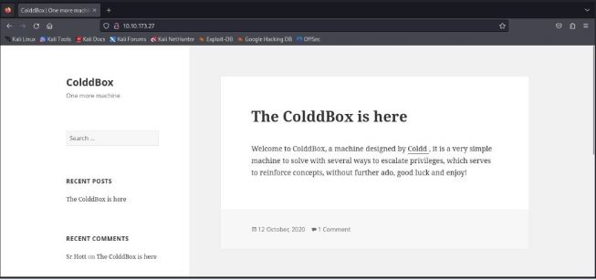
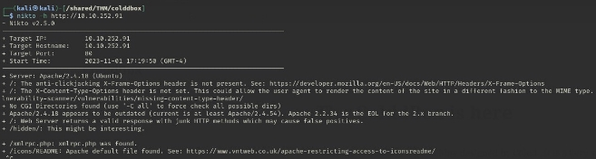
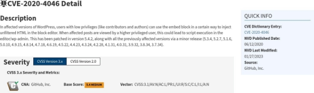
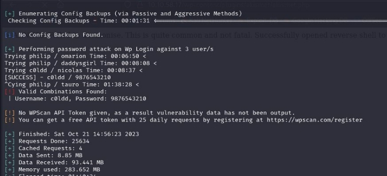
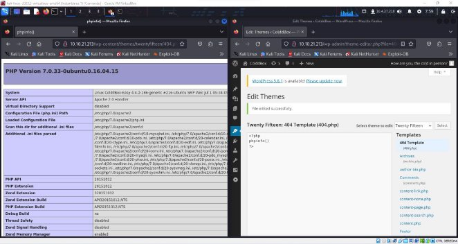
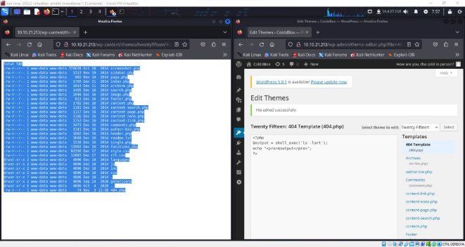
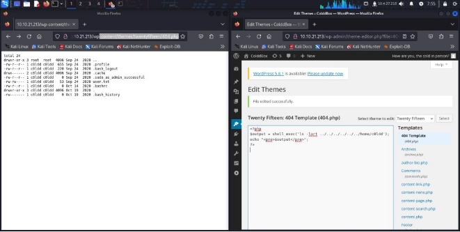
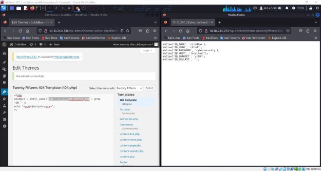
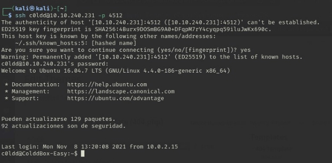

# The Importance of update your wordpress version.

---

**ColddBox Machine - Tryhackme**

In this first scenario we have chosen a machine with Linux operating system that contains a web server with a CMS Wordpress as this is quite used nowadays and I think it would be useful to include it in the project, as many companies do not usually update it much and I think it would be important to show what could happen if you do not update this CMS.

As a machine I will use the ColddBox machine that is on the page called Tryhackme, a machine where it contains different machines ready to be exploited without correcting the risk that may affect real environments, but they are simulated scenarios.

1. **Enumeration and Recognition**
1. First we will proceed to scan all the ports of the target machine, since we only have the ip address, but previously we can insert that ip in the browser to see if there is any website.

We see that there is a web page, but we are going to launch a scan with **nmap** to see if it has any other port.

To do this we will use the following command:

And it would show us the following result:

I used a slightly more advanced scan since a simple nmap scan showed only port 80 as shown in this screenshot.

Therefore, I have used the following parameters to make the scan a little more advanced

- **-sV** → This option enables the detection of service versions on nmap ports. That is, nmap will attempt to determine which service is running on each open port and which software version it uses.
- **-p-** → this option indicates that all TCP ports should be scanned. That is, nmap will attempt to connect to every TCP port in the range 1 to 65535.
- **--open** → this option indicates that only open ports should be shown, i.e. nmap will only show the ports that respond to connection requests.
- **--min-rate** → This option sets the minimum packet rate to 8000 packets per second. But this is an option not recommended for production environments as it tends to be very aggressive.
- **-Pn** → this option indicates that hosts that do not respond to ping requests should be ignored. That is, Nmap will not attempt to determine if the host is active before performing the scan.

Now let's go a little deeper and use the *(-p)* option to specify the two ports and *(-sCV)* for some more detailed information about the ports that are open on this machine. After analyzing the information returned by NMAP, it is confirmed that TCP ports 80 and 4512 are open and two services whose versions are already known are running on them.

With this information we obtain the following summary:

- **TCP 80** → HTTP service → Apache application version 2.4.18
  - **TCP 4512** → SSH Service → OpenSSH Application version 2.10 Ubuntu, Protocol 2.0

First, the HTTP service behind port TCP80 will be investigated and the whatweb and nikto tools will be used to obtain some additional information:

**HTTP (TCP80)**

Thanks to these two tools we can confirm that it really is an Apache web server with version 2.4.18 and using wordpress version 4.1.31 which means that this version of wordpress could be vulnerable as many older versions of this CMS can have vulnerabilities.

Searching for the wordpress version in the browser takes us to this NIST page, which leads us to the following CVE the 2020-4046 that if we look at the description would affect our version of wordpress. "According to **INCIBE**, in the affected versions, users even if they lack privileges as contributors and authors can use the built-in block in a certain way to inject unfiltered HTML code into the block editor. When the affected posts are viewed by a user with higher privileges, this could lead to a script execution in the editor/wp-admin file."

Now being wordpress, this CMS has a page called wp-admin, which contains a login that will take us to the administration panel of the website which will serve us to exploit this vulnerability. But the first step would be to know which users can access the administration panel.

To do so, we will launch the following command,

Wpscan -url\_ [\[_http://10.10.21.213_\](http://10.10.21.213/) _-enumerate u_](http://10.10.21.213/\))

What this command will do is with the -url parameter it will take the url of the wordpress website and the -enumerate u will enumerate only the users that I found.

We see that it shows us three users, of which, we create a small dictionary with these three names and using the same Wpscan tool along with the default dictionary rockyou we will try by brute force to get the password to access the control panel.

As we can see we got the password for the user c0ldd that would be 9876543210, then with this data we can proceed to access and move to the exploitation part.

**SSH (TCP 4512)**

Secondly, we proceed to investigate the ssh service behind the TCP4512 port and check that it does not allow login without password or with the default root password which would be toor.

**Vulnerability Analysis**

In the next phase as we have already achieved, obtain the username and password to access the control panel and thus be able to exploit the vulnerability of the wordpress editor which will allow us to obtain a reverse shell by inserting php code in the wordpress editor using the 404.php page located in the themes > themename and editor section.

But first we are going to perform a series of tests inserting small php snippets to check well that we can insert php code.

**TEST 1**

The first test we will perform will be to insert a small php function called phpinfo () which will show us detailed information about php such as its version and little else.

**TEST 2**

The second test will be to try to launch a simple command through a php statement, which will help us to verify in which directory we are and if we can really use commands from the server through wordpress.

**TEST 3**

Because we can list the current directories of the server and knowing already in folder we will find ourselves using the sequence *'..'.* Which in Linux means the previous directory then we will try to list if the user.txt exists and what permissions it has.

Now we know that we can use system commands, so as we are the www-data which is the web user in apache2, we can try to go to the folder where the wordpress configuration files are located and go to the wp- config.php file which is where we write the wordpress database data and take the username and password and try to connect via ssh.

Here we can see that using the following command *CAT ../../.../wp-config.php,* which shows us the wp-config file on the screen, in which we see the username and password

Used in the to configure the wordpress database, then what I am going to do is to insert *the db\_username and db\_password* to access the machine via ssh on port 4512 which is the one we found in the reconnaissance phase.

Here in this other screenshot I am going to show that I have been able to access via ssh using the credentials found in the wp-config.php file, which should belong to the database.

And now we could go to user.txt and read the flag of the user and we would already have a part that is to get access with a user of the system.

**Exploitation**

At this point, now that we have already analyzed the vulnerability and obtained access with a system user, in order to access the next flag we must access through **privilege escalation** and for this there are different points to check on the machine:

- The configuration and contents of the **passwd and shadow** files are checked: the only users with the bash shell assigned are "c0ldd" and "root". The /etc/shadow file is protected and readable only by root.
  - The user c0ldd, we will do a **sudo -l** to see if there is any program with root permissions that can run the user.
    - Search for files with special permissions **SUID and SGID**, no files with special permissions outside the standard for the correct operation of Linux Check scheduled 
      - tasks, to locate if there is any that run any script with high privileges, but there is none.
        - And **check the kernel version** as there may be some of the older Linux kernel versions that may be vulnerable, but this is not our case.

In our case the security flaw will be found in that when running sudo -l, it will take us to three binaries of which belong to root but the user has permission to run them using sudo.

These are the vim binaries (a text editor, which is used in Linux to edit files in terminal mode), the chmod tool (which is used to grant UGO permissions in Linux) and FTP (which is a file transfer protocol).

These three binaries could be useful for privilege escalation because thanks to the GTFoBins page, we can find a certain command to execute certain files that could give us root access.

In my case I am going to use ftp, which would be quite simple since what we can do will be with sudo in front run *ftp* in a normal way and when it opens a *shell* with the *ftp>* prompt we will enter ! /bin/sh*.*

But if we execute this same command without sudo in front of it, it will show us a normal shell, that is because sudo is what makes it possible to execute ftp as a privileged user.

And now you would have the root flag

**ColddBox-Easy scenario**

- Flag of the **user**: RmVsaWNpZGFFkZXMsIHByaW1lciBuaXZlbCBjb25zZWd1aWRvIQ==
  - **Root** flag: wqFGZWxpY2lkYWRlcywgbcOhcXVpbmEgY29tcGxxldGFFkYSE=

**Post-Exploitation**

As a **post-exploitation** task I am going to name some basic security notions to be able to fix these small bugs that have made us gain access to the host and be able to escalate privileges.

- First of all regarding the access to the wordpress control panel, we should use stronger passwords or passwords that are not in the common password dictionaries, since using a simple common dictionary found in kali Linux we have been able to access the CMS.
  - On the other hand it would be convenient to update the wordpress version since these possible bugs such as the one that we can insert commands from the server in the code editor in more recent versions is already patched. That is why it is very important to always use the latest version.
    - And also it would be convenient not to use the same user and password for the user of the server that for the user of the wordpress database if it is of a user 

with sudo privileges.

**Reporting and Mitigation**

**VULNERABILITY CVE:** 

**CVE** el 2020-4046

**SERVICE:** Wordpress Versions 5.4 and earlier.

**INFO: In** the affected wordpress versions, users with low permissions (such as contributors or authors) can take advantage of a block called "embed" to insert unrestricted HTML code in the block editor. When a user with higher permissions sees these higher messages, it could allow the execution of scripts in the editor or in the administration part of Wordpress (wp-admin).

**MITIGATION: and** in order to mitigate this problem the most advisable would be to update the version of wordpress because if there is a reason why there are more recent versions is because of that to correct this type of security flaws. In addition to monitor and restrict the privileges that are applied to users on the system. As well as there are many security plugins that can detect and prevent such attacks such as Wordfence Security, Sucuri Security, iThemes Security, BulletProof Security, All In One WP Security & Firewall, Security Ninja, MalCare Security, Cerber Security, Antispam & Malware Scan.

**ADDITIONAL INFORMATION:**

[https://nvd.nist.gov/vuln/detail/CVE-2020-4046 ]
[https://www.incibe.es/incibe-cert/alerta-temprana/vulnerabilidades/cve-2020-9046]